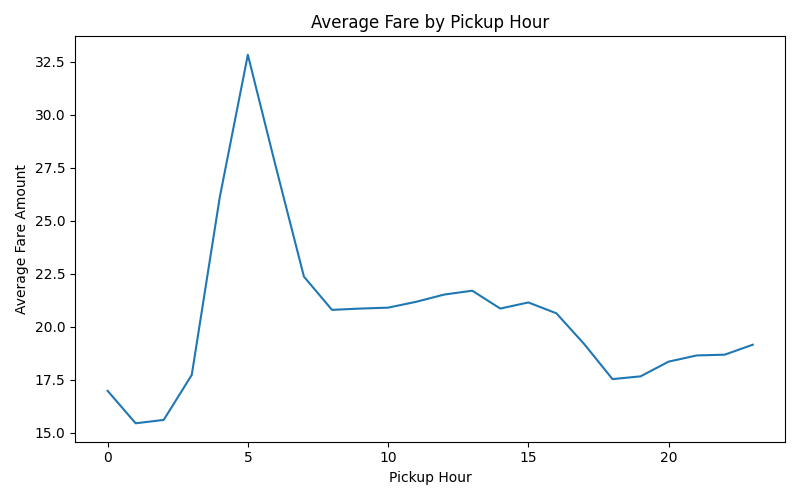

---

# NYC Taxi Data Pipeline & Analysis

## 📌 Objective
This project builds a reproducible data pipeline to clean, transform, and analyze NYC taxi trip data, 
combining data engineering and data analysis to extract actionable insights.

---

## 📂 Dataset
Dataset is not included due to size.

- Source: NYC Taxi Trip Data
- Size: ~83,000 trips
- Features:
  - Trip distance
  - Fare amount
  - Pickup & dropoff time
  - Location IDs
  - Payment type
  - Tip amount

---

## ⚙️ Project Structure

nyc-taxi-project/  
├── data/  
│   ├── raw/  
│   └── processed/  
├── docs/  
│   ├── trip_data_dictionary.pdf  
│   └── eda.pdf  
├── notebooks/  
│   └── eda.ipynb  
├── outputs/  
│   └── figures/  
│       └── fare_by_hour.png  
├── scripts/  
│   ├── clean_data.py  
│   ├── transform.py  
│   └── analysis.py  
├── README.md  
└── requirements.txt  

---

## 🔄 Data Pipeline

Raw Data → Cleaning → Transformation → Analysis → Visualization  

### 1. Data Cleaning (`clean_data.py`)
- Removes missing values in key columns  
- Converts numeric fields safely  
- Filters invalid values:
  - trip_distance > 0  
  - fare_amount > 0  
- Removes outliers:
  - trip_distance ≤ 100  
  - fare_amount ≤ 500  

---

### 2. Data Transformation (`transform.py`)
- Parses datetime fields  
- Extracts:
  - pickup_hour  
- Computes:
  - trip_duration (minutes)  
- Filters unrealistic trips:
  - duration > 0  
  - duration ≤ 300  

---

### 3. Analysis & Visualization (`analysis.py`)
- Groups data by pickup_hour  
- Computes average fare  
- Generates visualization:
  - outputs/figures/fare_by_hour.png  

---

## 🧹 Data Cleaning
Data quality issues were addressed through:

- Removing invalid values:
  - Negative fares  
  - Zero or negative trip distance  
  - Zero or negative duration  

- Filtering extreme outliers:
  - Distance > 50 miles  
  - Duration > 180 minutes  
  - Fare > $200  

This significantly improved statistical stability and removed unrealistic records.

---

## 📈 Key Analyses

### 1. Trips by Hour
- Peak demand at **11 AM (~5,769 trips)**
- Demand rises after 6 AM and declines after 8 PM  

👉 Insight: Strong mid-morning and daytime demand driven by commuting and business activity.

---

### 2. Trips by Weekday
- Highest demand on **Friday (~14,292 trips)**
- Lowest demand on Sunday  

👉 Insight: Taxi usage increases toward the end of the workweek.

---

### 3. Geographic Distribution
- Trips are highly concentrated in a few pickup and dropoff zones  

👉 Insight: Indicates strong urban hubs and travel corridors.

---

### 4. Payment Type Distribution
- Credit card: ~58%  
- Cash: ~42%  
- Others: <1%  

👉 Insight: Digital payments dominate taxi transactions.

---

### 5. Tip Behavior (Credit Card Only)
- Most tips fall between **10%–30%**
- Peak around **15%–25%**
- Many zero-tip cases exist  

👉 Insight: Tipping follows consistent social norms.

---

### 6. Fare vs Distance
- Strong positive correlation  
- Higher variance for longer trips  

👉 Insight: Pricing is distance-based but influenced by traffic and surcharges.

---

### 7. Heatmap (Weekday × Hour)
- Peak demand during weekday daytime hours  
- Friday consistently high, Sunday lowest  

👉 Insight: Demand depends on both time and weekday simultaneously.

---

## 🧠 Key Takeaways
- Demand peaks during mid-morning and weekdays  
- Taxi usage is geographically concentrated  
- Payment behavior is dominated by credit cards  
- Tipping follows predictable patterns  

---

## ▶️ How to Run

From the project root directory:

```bash
pip install -r requirements.txt

python3 scripts/clean_data.py
python3 scripts/transform.py
python3 scripts/analysis.py
```

---

## 🛠️ Tools Used
Python
Pandas
NumPy
Matplotlib
Seaborn

---

## ⚠️ Limitations
Location IDs are not mapped to actual geographic zones
Threshold-based cleaning may remove valid extreme trips
Dataset is a sample and may not represent all NYC trips

---

## 🚀 Future Work
Map locations to real NYC zones
Build demand forecasting model
Add dashboard (Streamlit / Tableau)
Extend pipeline to larger datasets (Spark)

---

## 📄 Additional Notes
Detailed exploratory analysis is available in docs/eda.pdf.

---

## 👤 Author
Shengqian Huang
UCLA Data Theory
