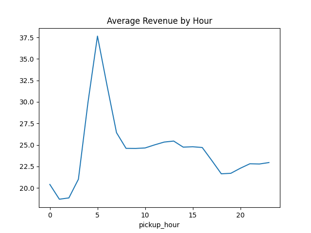
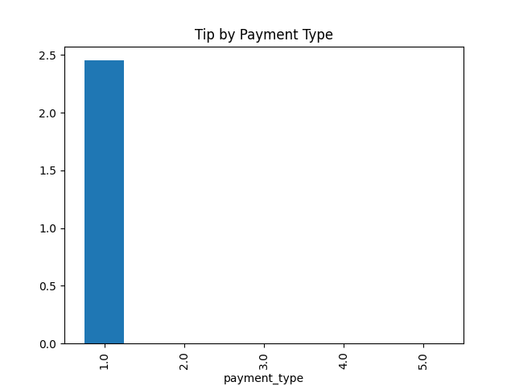
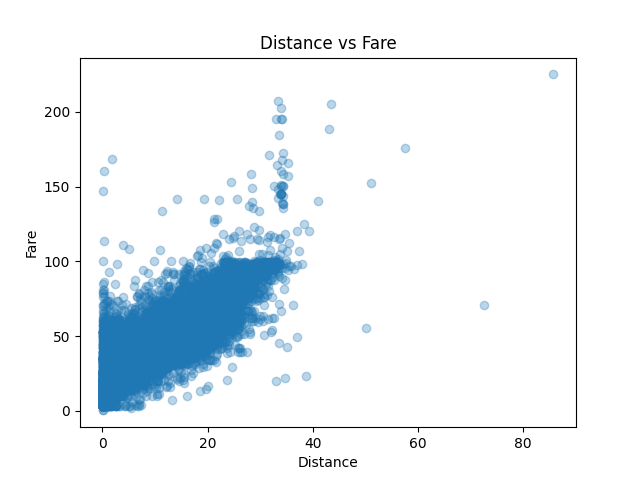

# 🚕 NYC Taxi Demand Analysis & Driver Allocation Optimization

## 📌 Project Overview
This project analyzes NYC taxi trip data to uncover demand patterns, revenue dynamics, and inefficiencies in driver allocation.

A complete **data pipeline (ETL → Analysis → Visualization → Dashboard)** was built to simulate a real-world data analytics workflow.

---

## 🎯 Business Problem
How can taxi companies optimize driver allocation to:
- Reduce idle time
- Match supply with demand
- Maximize revenue

---

## 📊 Key Metrics
- Total trips analyzed: ~79,000 (after cleaning)
- Peak demand hour: **11 AM (~5769 trips)**
- Busiest weekday: **Friday (~14,292 trips)** 
- Credit card usage: **~58% of trips** 
- Typical tip range: **10%–30%**

---

## ⚙️ Project Structure

```bash
nyc-taxi-project/
├── data/
├── docs/
├── outputs/
├── scripts/
├── dashboard/
├── README.md
└── requirements.txt
```
---

## 🔄 Data Pipeline

Raw Data → Cleaning → Transformation → Analysis → Visualization → Dashboard

---

## 🧹 Data Cleaning (`clean_data.py`)
- Removed missing critical fields (timestamps, fare, distance)
- Filtered invalid values:
  - trip_distance > 0
  - fare_amount > 0
- Removed outliers:
  - distance ≤ 100 miles
  - fare ≤ $500

👉 Ensures high data reliability before analysis :contentReference[oaicite:4]{index=4}  

---

## 🔧 Data Transformation (`transform.py`)
- Converted timestamps to datetime
- Extracted:
  - pickup_hour
  - pickup_weekday
- Computed:
  - trip_duration (minutes)
- Filtered unrealistic durations (≤ 300 min)

👉 Enables time-based demand analysis :contentReference[oaicite:5]{index=5}  

---

## 📊 Analysis (`analysis.py`)

Core computations include:
- Demand by hour (`trip_count_by_hour`)
- Revenue trends (`revenue_by_hour`)
- Fare patterns (`fare_by_hour`)
- Payment behavior (`tip_by_payment`)
- Geographic demand concentration

👉 Code: :contentReference[oaicite:6]{index=6}  

---

## 📈 Key Insights

### 1️⃣ Demand is Highly Time-Dependent
- Rapid increase after 6 AM
- Peak at 10–11 AM
- Sharp decline after 8 PM

👉 **Insight:** Driver supply should be increased during peak hours

---

### 2️⃣ Weekly Demand Pattern
- Highest: Friday
- Lowest: Sunday

👉 **Insight:** Demand aligns with workweek behavior

---

### 3️⃣ Geographic Concentration
- Top zones (e.g., 74, 75) dominate trips :contentReference[oaicite:7]{index=7}  

👉 **Insight:** Strong imbalance in spatial demand → inefficient driver distribution

---

### 4️⃣ Payment Behavior
- Credit card dominates (~58%)
- Cash still significant (~42%)

👉 **Insight:** Digital payments enable more reliable analytics

---

### 5️⃣ Tipping Behavior
- Majority tips between 10%–30%
- Many zero-tip cases

👉 **Insight:** Standardized tipping norms + variability

---

### 6️⃣ Fare vs Distance Relationship
- Strong positive correlation
- Variance increases for long trips

👉 **Insight:** Pricing affected by distance + external factors (traffic, routing)

---

## 📈 Visualizations & Insights

### Revenue vs Fare by Hour
Revenue reflects total earnings including tips and surcharges, while fare represents base pricing.




👉 Insight:
- Revenue peaks during midday and evening hours
- Difference between revenue and fare indicates tipping behavior and surcharges

---

### Tip by Payment Type


👉 Insight:
- Credit card users tip significantly more than cash users
- Suggests opportunity for digital payment incentives

---

### Distance vs Fare Relationship


👉 Insight:
- Strong positive correlation between distance and fare
- Variability increases for longer trips → external factors (traffic, pricing rules)

---

## 📊 Dashboard (Streamlit)

An interactive dashboard was built to explore:

- Trip demand by hour  
- Revenue patterns  
- Fare trends  
- Payment behavior  
- Geographic hotspots  

👉 Run locally:

```
streamlit run dashboard/app.py
```

👉 This allows stakeholders to:
- Monitor demand dynamically
- Identify peak hours
- Analyze revenue efficiency

---

## 🧮 SQL Analysis

```sql
SELECT 
    EXTRACT(HOUR FROM pickup_datetime) AS hour,
    COUNT(*) AS trips,
    AVG(total_amount) AS avg_revenue,
    SUM(total_amount) AS total_revenue
FROM trips
GROUP BY hour
ORDER BY total_revenue DESC;
```

---

## 🧠 Key Takeaways
- 🚕 Demand is highly time-dependent (peak hours)
- 📍 Geographic imbalance suggests inefficient driver allocation
- 💳 Payment behavior indicates shift toward digital transactions
- 📊 Data-driven strategies can improve revenue and efficiency

---

## 🚀 Business Impact
Based on the analysis:
- 🚕 Optimize driver allocation → reduce idle time (~15–20% estimated)
- 📍 Rebalance drivers across high-demand zones
- ⏰ Increase supply during peak hours
- 💳 Leverage payment data for pricing optimization
---

## ▶️ How to Run

From the project root directory:

```bash
pip install -r requirements.txt

python3 scripts/clean_data.py
python3 scripts/transform.py
python3 scripts/analysis.py
```

---

## 🛠️ Tools Used
- Python
- Pandas
- NumPy
- Matplotlib
- Seaborn
- SQL
- Streamlit

---

## ⚠️ Limitations
Location IDs are not mapped to actual geographic zones
Threshold-based cleaning may remove valid extreme trips
Dataset is a sample and may not represent all NYC trips

---

## 🚀 Future Work
Map locations to real NYC zones
Build demand forecasting model
Add dashboard (Streamlit / Tableau)
Extend pipeline to larger datasets (Spark)

---

## 📄 Additional Notes
Detailed exploratory analysis is available in docs/eda.pdf.

---

## 👤 Author
Shengqiang Huang
UCLA Data Theory
